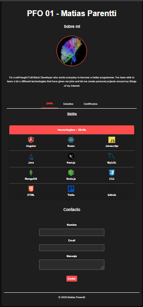

# Portfolio Matias Parentti

* Portfolio personal para la materia de Frontend de la tecnicatura en desarrollo de Software. 

Este proyecto cuenta con una seccion de About seguido de las secciones de Tecnologias aprendidas, Estudios cursados y certificados obtenidos. Por ultimo una seccion de Contacto. 

* Proximo update: Seccion de Proyectos con enlaces a los repositorios y proyectos deployados.

* A futuro hacer un CRUD para el backend y la bdd y poder gestionar todas las secciones del portfolio.

